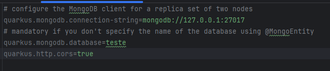
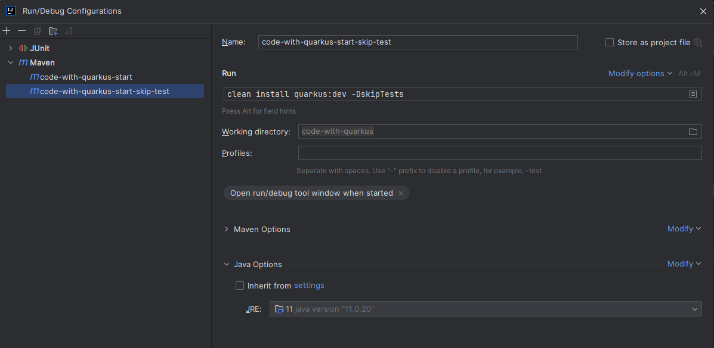
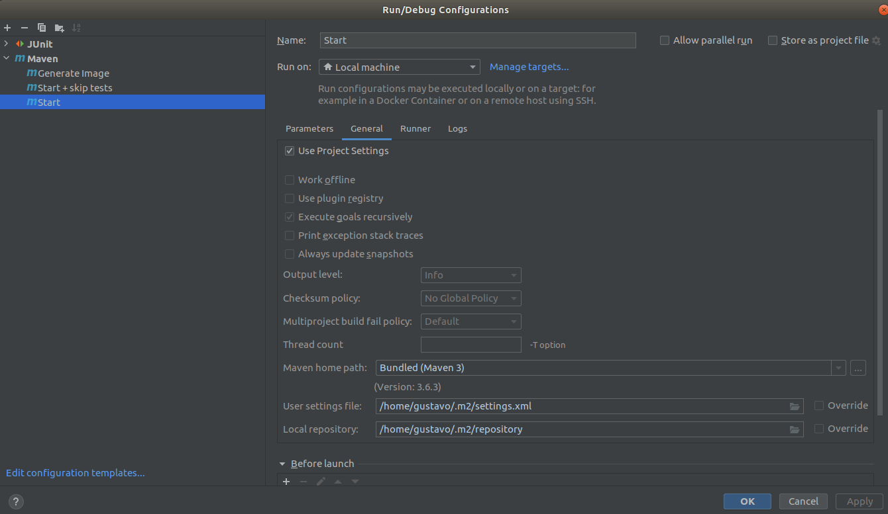

<h1 align="center">
  Desafio Técnico Luizalabs - 04/2024
</h1>
<p align="center">
  
  <a href="https://github.com/gustavocarvalhoti/quarkus-luiza-labs/commits/main">
    
  </a>
 <br>
  <a href="https://www.linkedin.com/in/gustavocarvalho-ti/">
      
  </a> 
</p>
<strong>
<br>
<p align="center">
  <a href="#bookmark-sobre">Sobre</a>&nbsp;&nbsp;&nbsp;|&nbsp;&nbsp;&nbsp;
  <a href="#computer-tecnologias">Tecnologia</a>&nbsp;&nbsp;&nbsp;|&nbsp;&nbsp;&nbsp;
  <a href="#wrench-ferramentas">Ferramentas</a>&nbsp;&nbsp;&nbsp;|&nbsp;&nbsp;&nbsp;
  <a href="#package-instalação">Instalação</a>&nbsp;&nbsp;&nbsp;|&nbsp;&nbsp;&nbsp;
  <a href="#memo-license">License</a>
</p>
</strong>
<br>

<p align="center">
    
</p>

## :bookmark: Sobre

**wishlist-api** <br><br>
Endpoints disponíveis: <br>
Get: <br>
http://localhost:8080 <br>
http://localhost:8080/wishlist <br>
http://localhost:8080/wishlist/CUSTOMER1 <br>
http://localhost:8080/wishlist/CUSTOMER1/PRODUCT2 <br>

Post:<br>
http://localhost:8080/wishlist

````
{
	"customerId": "CUSTOMER1",
	"productId": "PRODUCT2",
	"productName": "Iphone 15",
	"productValue": 12000,
	"quantity": 1
}
````

Delete:<br>
http://localhost:8080/wishlist/CUSTOMER1/PRODUCT2 <br>

A colection está disponível nas pasta: src/main/resources/local/collection-Insomnia_2024-04-22

## :computer: Tecnologias e metodologias

- **[Quarkus](https://quarkus.io/)**
- **[Java 11](https://www.oracle.com/br/java/technologies/javase-jdk11-downloads.html)**
- **[GraalVM](https://www.graalvm.org/)**
- **[Arquitetura Hexagonal](https://engsoftmoderna.info/artigos/arquitetura-hexagonal.html)**
- **[Maven](https://maven.apache.org/)**
- **[Docker](https://www.docker.com/)**
- **[Docker Compose](https://docs.docker.com/compose/install/)**
- **[Mongodb](https://www.mongodb.com/)**
- **[Quarkus Resteasy](https://quarkus.io/)**
- **[Quarkus Junit5 e Mokito](https://quarkus.io/)**
- **[Rest Assured](https://quarkus.io/)**
- **[Quarkus Panache](https://quarkus.io/)**

<br>

## :wrench: Ferramentas

- **[IntelliJ](https://www.jetbrains.com/)**
- **[Insomnia](https://insomnia.rest/)**
- **[Google Chrome](https://www.google.com/chrome/)**

<br>

## :package: Instalação

### :heavy_check_mark: **Pré-requisito**

Instalar os softwares abaixo:

- **[Git](https://git-scm.com/)**
- **[Maven](https://maven.apache.org/)**
- **[Docker](https://www.docker.com/)**
- **[Docker Compose](https://docs.docker.com/compose/install/)**
- **[GraalVM](https://www.graalvm.org/) (Somente no modo desenvolvedor)**

<br>

### :arrow_down: **Clonando o repositório**

```sh
  $ git clone https://github.com/gustavocarvalhoti/quarkus-mongo-hexagonal.git
```

<br>

### :arrow_forward: **Executando a aplicação**

```sh
  $ cd backend
  $ ./mvnw compile quarkus:dev
```

#### Configurando o IntelliJ e Mongodb

##### Criar o container do Mongodb

```sh
  $ docker pull mongo
  $ docker run -d -p 27017-27019:27017-27019 --name mongodb mongo   #Criar o banco
  $ docker exec -it mongodb bash                                    #Entrar no banco
```

##### Apontar para o Java do GraalVM


##### Alterar o application.properties



##### Iniciar a aplicação



##### Utilizei o Maven 3.6.3 para executar todos os comandos



##### Gerar a imagem compilada pelo Graal VM, fica muito mais rápido o start do servidor


<br>

## Como iniciar o projeto

```
cd backend
./mvnw compile quarkus:dev
```

## Configurando o Mongodb

```
docker pull mongo
docker run -d -p 27017-27019:27017-27019 --name mongodb mongo <- Criar o banco
docker exec -it mongodb bash <- (Entrar no banco)
```

### Verifique se a criou corretamente o cantainer

<br/>

### Testando o Mongo database

```
Instalar o Mongo Compass no site abaixo:
https://www.mongodb.com/pt-br/products/tools/compass

use teste                               <- Prepara para criar o banco
db.user.insert({name: "Gus", age: 34})  <- Cria o banco nesse insert
db.user.find()                          <- Pesquisa
show dbs                                <- Verifica os bancos existentes
```

## :memo: License

This project is under the **MIT** license.